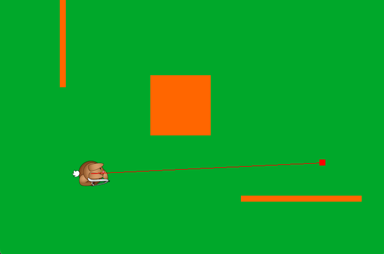

# Line of Sight

To determine if an enemy can see the player a mathematical model that tells us if there is a direct line of sight and is simple and reasonably accurate.  

One option is to draw a line between the center of the player and the enemy then see if that line intersects with any obstacles.  If the line intersects with any obstacles the enemy cannot see the player.  This algorithm is imperfect but simple and fast to calculate.



First we need a line between the player and enemy.  A line is defined by it's two endpoints, so to create the line we need to get the center of the player and the enemy.  The Pygame [Rect](https://www.pygame.org/docs/ref/rect.html#pygame.Rect) class has an attribute called `center` so we can use a `Rect` representing each to calculate the center.

Second we need a function that determines if a line intersects a rectangle.  The `Rect` class has a function called [clipline](https://www.pygame.org/docs/ref/rect.html#pygame.Rect.clipline) that takes a line as input and returns that line clipped within the rectangle.  This may not seem like it tells us if a line intersects with a rectangle but reading the documentation says that __*If the line does not overlap the rectangle, then an empty tuple is returned.*__.  So if `clipline` returns an empty value there is no intersection and if it returns a line there is an intersection.

So the following codes shows how `clipline` could be used.

```python
if obstacleRect.clipline(enemyRect.center, playerRect.center):
    # line of sight from enemy to player is blocked by obstacle!
```

How could this code be integrated into the logic where enemies are moved?
